# Biology notes on Human Lungs from [Youtube](https://www.youtube.com/watch?v=Zm6lzuozJUc)

### Feature A - inflammatory cells in human lung histology

Inflammatory cells play a crucial role in the immune response within the lungs. These cells are part of the body's defence mechanism against infections, irritants, or other harmful stimuli.
When the lungs encounter a threat, such as pathogens (bacteria, viruses), allergens, or pollutants, the immune system responds by recruiting inflammatory cells to the affected area.

Some key inflammatory cells involved in lung inflammation include:

##### Neutrophils 
These are white blood cells that are among the first responders to infections. Neutrophils are particularly effective at destroying bacteria and other pathogens.

##### Macrophages
These cells are responsible for engulfing and digesting foreign substances, dead cells, and other debris. Macrophages also play a role in presenting antigens to other immune cells, thus initiating a more targeted immune response.

##### Eosinophils
Primarily involved in allergic reactions and parasitic infections, eosinophils release substances that contribute to inflammation. Elevated eosinophil levels may indicate allergic or inflammatory conditions.

##### Lymphocytes
Including T cells and B cells, lymphocytes are crucial for specific immune responses. T cells can directly attack infected or abnormal cells, while B cells produce antibodies that target specific invaders.
Inflammation is a natural and necessary process for defending the body. However, chronic inflammation in the lungs can lead to various respiratory conditions, such as asthma, chronic obstructive pulmonary disease (COPD)
 

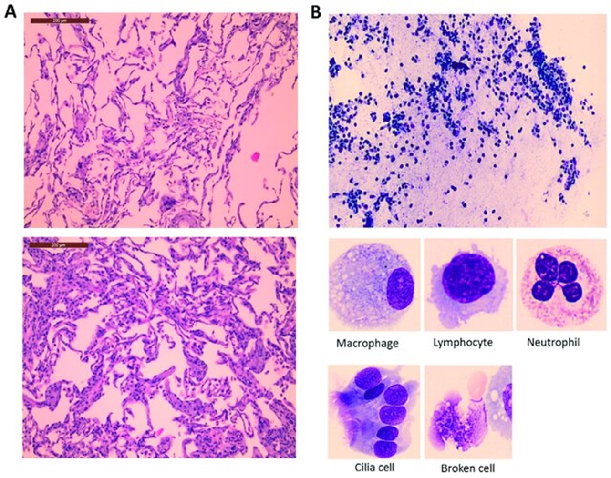

# H&E slides
The tissue is cut into pieces and put into cassette and fixed with wax and paraffin. A very thin section picked up by technician on a slide and slide goes for staining which is Hematoxylin and eosin (H and E).

# Airspace and empty space within alveolus

##### Abnormal things
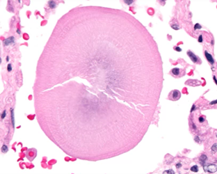
Round structure which is called **corpora amylacea** which is found in older people as an artifact in human lungs.
 

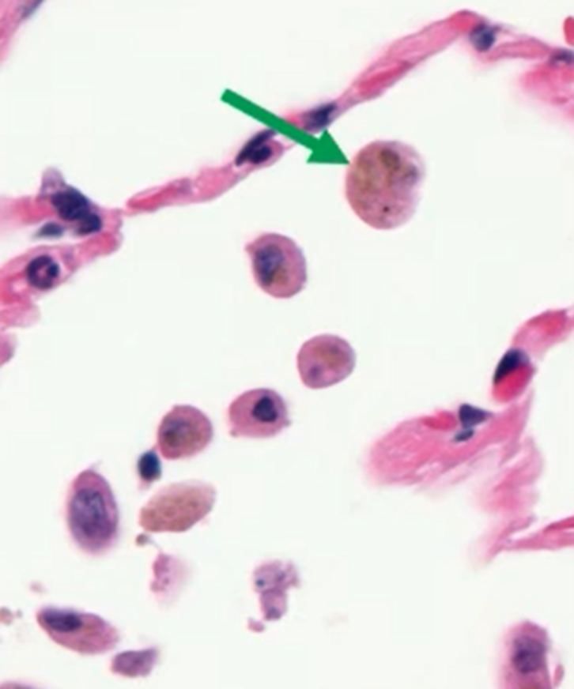
**Pigmented macrophages** in airspace (smoker’s macrophage)
##### Macrophages
These cells are responsible for engulfing and digesting foreign substances, dead cells, and other debris. Macrophages also play a role in presenting antigens to other immune cells, thus initiating a more targeted immune response. Big cells eat up smoke.
 

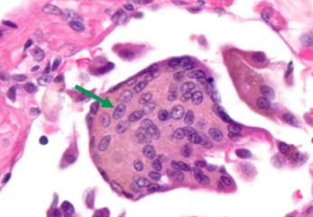
**Multi nucleated cells** within an airspace. Normal cell has one nucleus. 
 
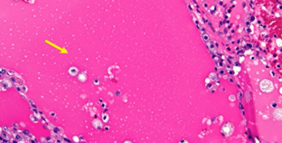
**Pink edema (inflammation) fluid**
Patients with heart failure mostly.
 
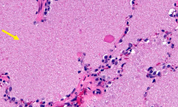
**Pink granular material** within airspace (pulmonary alveolar proteinosis (PAP))
 
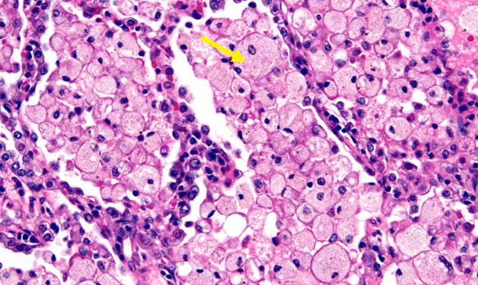
**Foamy Macrophages** within airspaces(obstruction of bronchi) (filled with lipid)
 
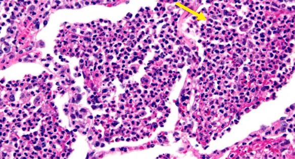
**Neutrophils** within airspace (acute bronchopneumonia)
##### Neutrophils
These are white blood cells that are among the first responders to infections. Neutrophils are particularly effective at destroying bacteria and other pathogens.

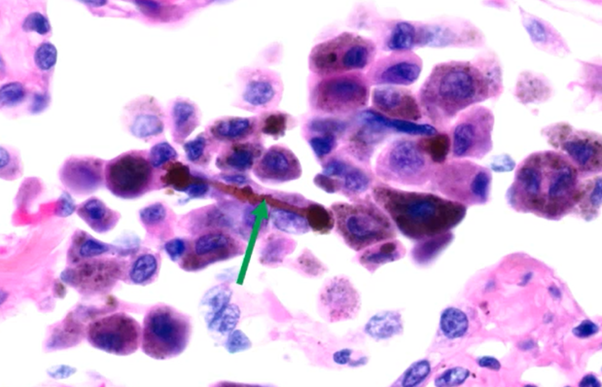 
**Asbestos body** (dumbbell shape)
 
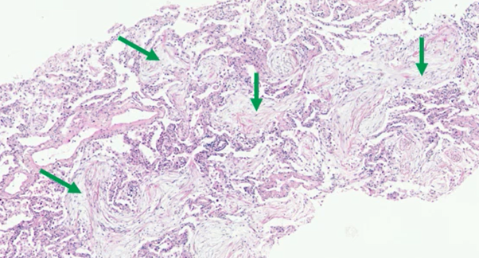
**Fibroblast** plugs within airspaces (organizing pneumonia).
##### Fibroblast
A fibroblast is a type of biological cell that synthesizes the extracellular matrix and collagen, produces the structural framework (stroma) for animal tissues, and plays a critical role in wound healing. Fibroblasts are the most common cells of connective tissue in animals. Instead of neutrophils goes away this remained. Fibroblast grows in alveolus. Airspace is empty space 

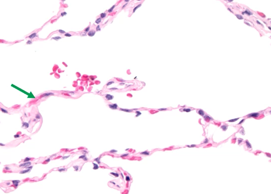
**Alveolar septa (plural) or septum**

 
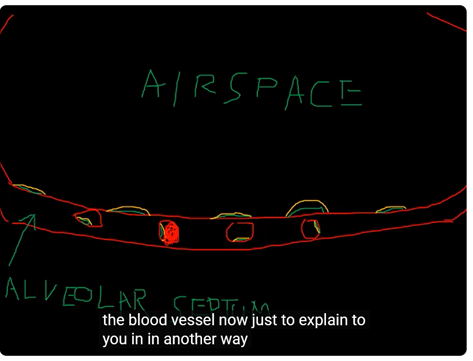
**Alveolar septum**
Each of these red circles are one capillary. Green is the nucleus in the (Endothelial cells) cell inside the capillary and yellow is the cytoplasm. 
 Signals from endothelial cells organize the growth and development of connective tissue cells that form the surrounding layers of the blood-vessel wall.
Red blood cell in the second capillary. Blood gets washed out.
Cells on top of alveolar septa is called epithelial cells (connective tissue). In real slide green arrows shows pneumocytes which are cells line alveoli (lung cells which are epithelial cells). 
 
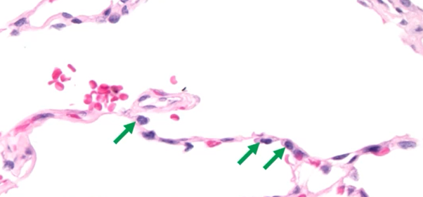
**Pneumocytes**

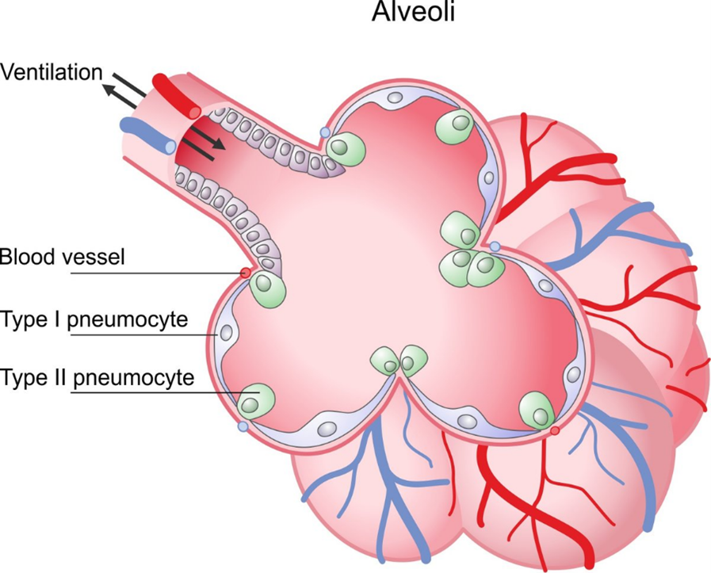
**Alveoli**

 

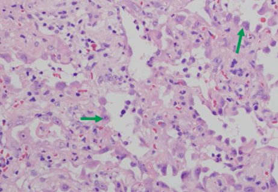
**Pneumocytes** are line on top of alveoli. Flat pneumocytes are flat called type I. Type II pneumocyte are not laying down but more standing on top of alveoli.
Not flat. Type II pneumocyte green arrows.
When a damage happen, Type II pneumocytes grow. They produce surfactant.   
  

 

**Alveoli septa** is main component for interstitial part of lung. 
Interstitial lung disease all abnormality grows in lung on alveoli.

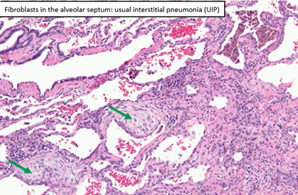

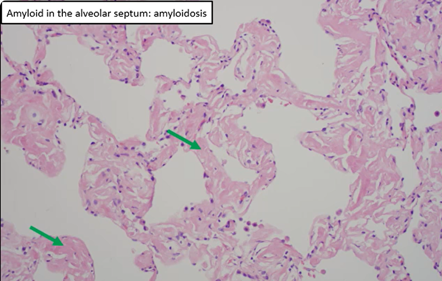

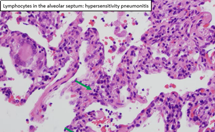

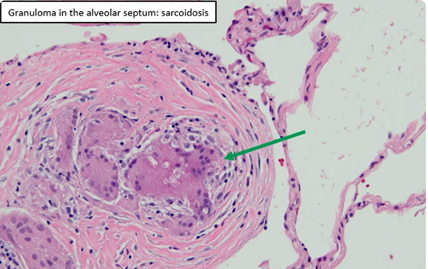 
 
All these are **interstitial** lung diseases.

# Bronchi

Bronchus breathing tubes. Bronchi branch out into lungs. Mucosal side of view with a camera. Strained with H and E. cartilage is a feature of bronchi. Airway a umbrella term.

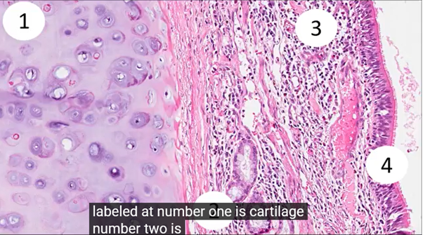

**Cartilage** on the left. **Right mucosa** and **submucosa**. 
1.	Cartilage. 
2.	Outermost part of submucosa
3.	Mucosa
4.	Part of mucosa but more inner is epithelial.

Cartilage is an important structural component of the body. It is a firm tissue but is softer and much more flexible than bone.
Cartilage is a connective tissue found in many areas of the body including: Joints between bones e.g. the elbows, knees and ankles, Ends of the ribs, Between the vertebrae in the spine, Ears and nose

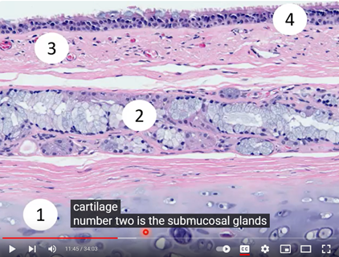
#### Bronchial tubes or airways
 
1.	Cartilage
2.	bronchial glands (salivary link mouth)
3.	Mucosa and submucosa (combination) pinks are collagen
4.	Epithelium

Mucosa inner most lining of anything. The inner part of bronchus. Most epithelial cells. A bit of stromal cells below epithelial cells. 

