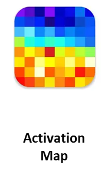

# Gradient-weighted Class Activation Mapping (Grad-CAM) 

The Gradient-weighted Class Activation Mapping (Grad-CAM) [44] algorithm computes the gradients of each target class (e.g., ‘low’, ‘medium’, and ‘high’) with respect to the model’s last convolutional layer, identifying regions of the image that most influence the final prediction for that class. The resulting map is a coarse-grained activation map, which must be resized to accurately overlay and highlight the activated areas on the original input image.

The [first](./Visualize_Grad_Cam_initial_relu.ipynb) file illustrates the workflow using the initial ReLU activation function. The [second](./Visualize_GradCam_different_Activation_function.ipynb) notebook presents the analysis after replacing the activation function with ELU and Leaky ReLU, and so on. The [final](./Visualize_GradCam_train_more_layers.ipynb) notebook displays the activation maps for models with [deeper](../Train_more_layers/) layers trained.