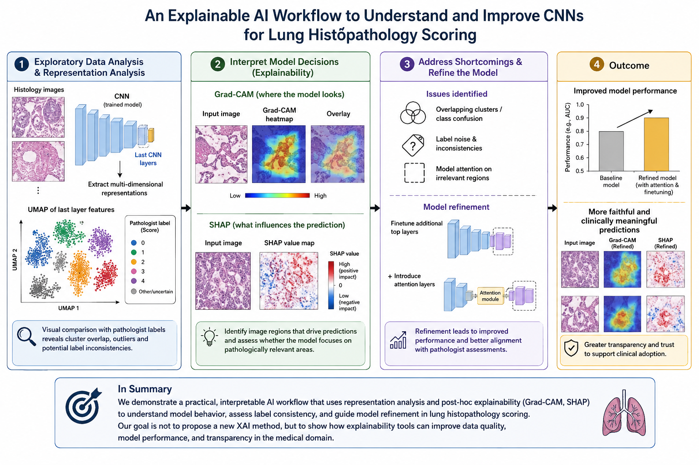
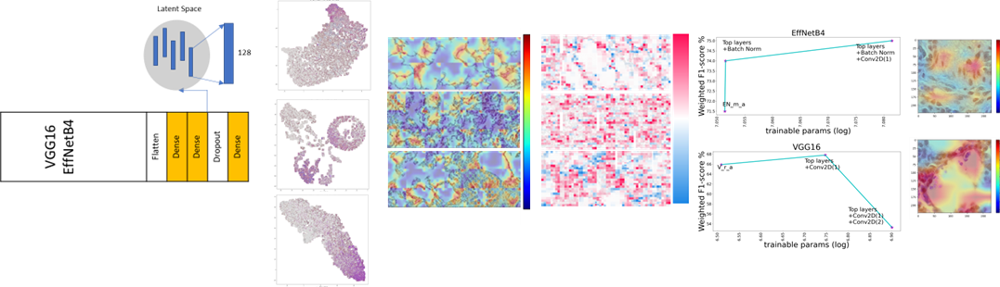
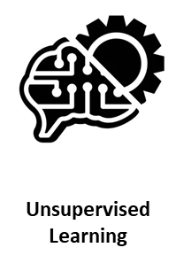
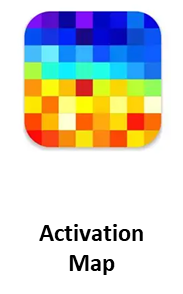

# From Pixels to Pathology: Explainable CNNs in Lung Tissue Analysis

This repository accompanies the manuscript **_“From Pixels to Pathology: Explainable CNNs in Lung Tissue Analysis.”_**

This work is a continuation of our previous manuscript [(Here)](https://www.biorxiv.org/content/10.1101/2023.05.12.540340v1.abstract) and [code](https://github.com/Aitslab/lunghisto), focusing on:

- **Numerical analysis** of deep learning models for lung tissue classification  
- **Explainable AI (XAI) algorithms** to connect pathology-driven features with model-driven representations  

The goal of this study is to enhance interpretability and transparency in CNN-based lung pathology analysis by bridging computational features with domain-specific pathology insights.


The raw data is from [(data)](https://www.ebi.ac.uk/biostudies/bioimages/studies/S-BIAD419). 

In our previous publication, we employed CNN architectures, including VGG16 and EfficientNet, combined with various image augmentation techniques, to classify the extent of damage in histology slides.


In this work, we explored post hoc explainability algorithms applied to our best-performing models from previous studies. These analyses included [clustering and pattern discovery](https://github.com/Aitslab/Histology_XAI/tree/main/Unsupervised)  in feature vectors, generating [Grad-CAM](https://github.com/Aitslab/Histology_XAI/tree/main/GradCAM) activation maps for image tiles, and computing and visualizing [SHAP](https://github.com/Aitslab/Histology_XAI/tree/main/SHAP) values for the trained models. In subsequent steps, we trained new models with [deeper architectures](https://github.com/Aitslab/Histology_XAI/tree/main/Train_more_layers) and incorporated [attention layers](https://github.com/Aitslab/Histology_XAI/tree/main/Attention) for improved performance. All experiments were conducted using both the previously optimized models and the newly developed ones, along with the same dataset.




# Discovering Structure in Latent Representations via Unsupervised Clustering
The latent representations of the tiles, extracted from the final layer of the three-class classifier, were processed using unsupervised dimensionality reduction algorithms such as UMAP and t-SNE. The first two components were then visualized in three ways:

1- Colored by treatment group (Control, ECMO, ECMO+LPS, MV, MV+LPS),

2 -Colored by the model’s predicted classes (low, medium, high), and

3 -Colored by the gold standard labels (low, medium, high) for direct comparison between predicted and true classifications.


The [first](./Unsupervised/Histo_unsupervised_featurespace_VGG16.ipynb) notebook documents the complete workflow for VGG16-based models, and the [second](./Unsupervised/Histo_unsupervised_featurespace_EffnetB4.ipynb) outlines the corresponding process for EfficientNet-based models.



# Gradient-weighted Class Activation Mapping (Grad-CAM) 


The Gradient-weighted Class Activation Mapping (Grad-CAM) algorithm computes the gradients of each target class (e.g., ‘low’, ‘medium’, and ‘high’) with respect to the model’s last convolutional layer, identifying regions of the image that most influence the final prediction for that class. The resulting map is a coarse-grained activation map, which must be resized to accurately overlay and highlight the activated areas on the original input image.

The [first](./GradCAM/Visualize_Grad_Cam_initial_relu.ipynb) file illustrates the workflow using the initial ReLU activation function. The [second](./GradCAM/Visualize_GradCam_different_Activation_function.ipynb) notebook presents the analysis after replacing the activation function with ELU and Leaky ReLU, and so on. The [final](./GradCAM/Visualize_GradCam_train_more_layers.ipynb) notebook displays the activation maps for models with [deeper](./Train_more_layers/) layers trained.


# SHAP (SHapley Additive exPlanations) 

In this [section](SHAP/Histo_Shap_values.ipynb), We have Generated SHAP explanations (activation/importance maps) and  Visualized both the tile and its SHAP explanation to perform XAI (explainable AI) on image tiles.

we have created  SHAP image masker
``` python
masker = shap.maskers.Image("inpaint_ns", tmp_img.shape)
```
SHAP masked parts of the image. This helps evaluate which regions(pixels) contribute to the output.

We then Created the SHAP explainer:
``` python
explainer = shap.Explainer(pretrained_model, masker, output_names=['low','medium','high'])
```
where pretrained_model is the ML model We are explaining (En_m_a). output_names labels the model’s output classes.

The I have Computed SHAP values as:
```python
shap_values = explainer(y, outputs=shap.Explanation.argsort.flip[:3])
```
and  Produced SHAP attribution maps for the model’s top 3 predicted classes where this tells us which pixels influenced the model.


# Deeper architecture 

In order to improve F1-score from previous models, we unfroze additional deeper layers from the [VGG16](./Train_more_layers/Histo_train_moreLayers_VGG16.ipynb) and [EffNetB4](./Train_more_layers/Histo_train_moreLayers_EffnetB4.ipynb) models for training: one or two convolutional layers for the [VGG16](./Train_more_layers/VGG_train_more_layers.png) model and batch normalization and convolutional layers for [EffNetB4](./Train_more_layers/ENB4_train_more_layers.png) model, respectively.

To avoid overfitting when increasing the number of trainable parameters, we expanded the training dataset sevenfold by adding deterministic augmentations as brightened and blurred versions of the images (blurring filters with (2,2) and (3,3) kernel sizes and adjusting brightness to 0.8 and 1.3 and combinations of both blurring with kernel size of (3,3) and change of brightness to 0.8 and 1.3) added to original dataset and also applied additional random augmentations such as random rotation, flipping, and changes in brightness during training with “ImageDataGenerator” function during training.  

The results for best models are summarized in [VGG16](./VGG_train_more_layers.png) and [EffNetB4](./ENB4_train_more_layers.png).


# Attention 

Attention mechanism with convolutional and locally connected layers are added to the main architecture. The convolutional layers were utilized as filters to extract features from images. This then refined to attention weights by a ‘locally Connected’ layer with ‘sigmoid’ activation function. The attention weights then scaled and multiplied with image data. The masked features and the scaled attention weights were tracked in each epoch of training.  Randomly selected attention maps for the best model for each fold were inspected manually. 


The [Training](./Attention/Training/Attention.py) code and [visualization](./Attention/Attention_visualization.ipynb) of sample attention maps are described [here](./Attention/). results of models with adding attention layers are also 
discussed [here](./Attention/Attention_results_table.ipynb) and [here](./Attention/Attention_results_table_EffNet.ipynb). 
