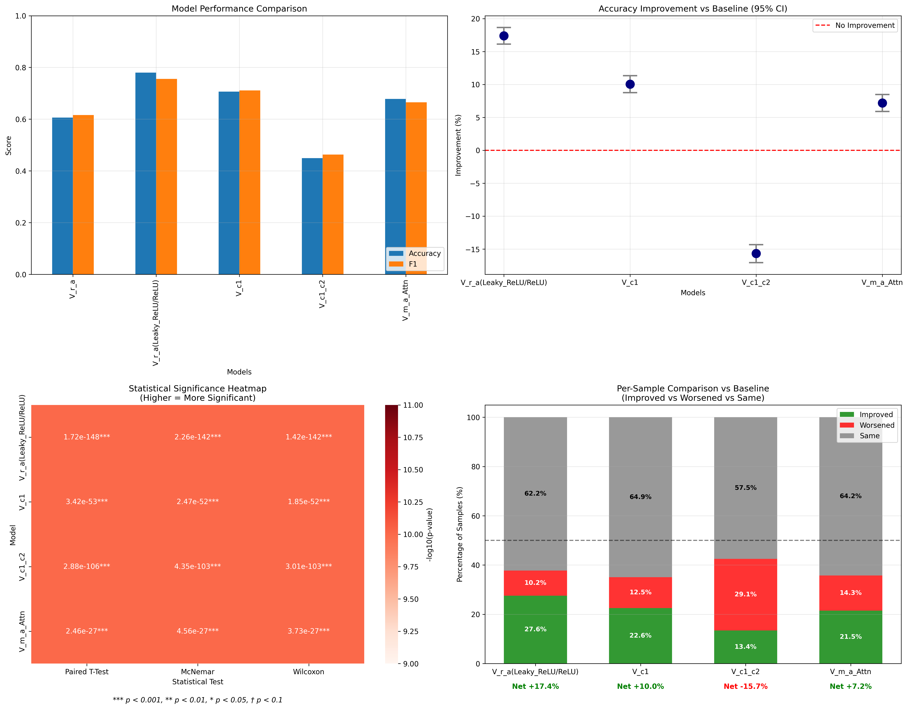
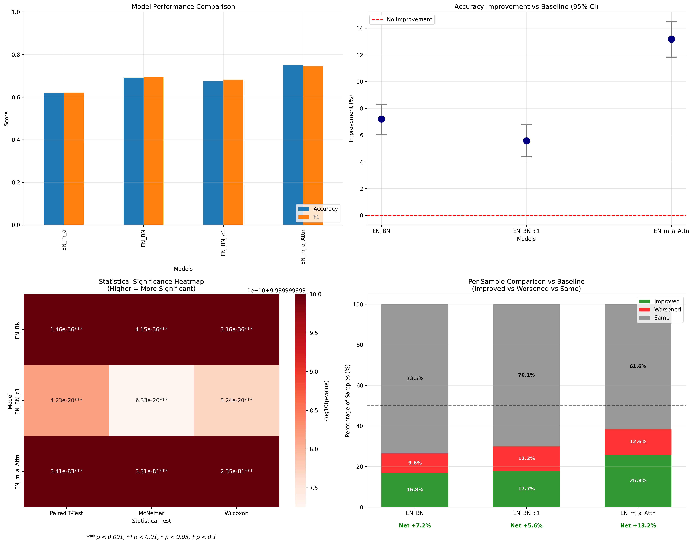
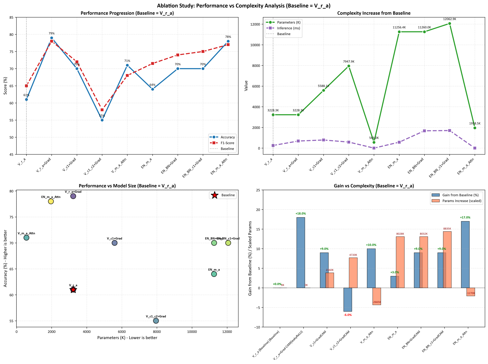

# Statistical Analysis

In this [section](Statistical_significancy.ipynb), We performed comprehensive statistical significance tests comparing our  
improved models against the baseline using all samples (n=8,073) as paired data points.

**Statistical Tests Performed:**

1. **Paired t-test**: Compares mean correctness scores between baseline and each 
   improved model to determine if the average improvement is statistically 
   different from zero.

2. **Wilcoxon signed-rank test**: A non-parametric alternative that ranks the 
   magnitude of differences, robust for non-normal distributions and outliers.

3. **McNemar's test**: Examines the contingency table of correct/incorrect pairs 
   to test if significantly more samples improved than worsened.

4. **Bootstrap 95% confidence intervals**: Resamples data with replacement 10,000 
   times to estimate the true improvement distribution; intervals excluding zero 
   confirm statistical significance without distributional assumptions.

**Results Summary:**

All tests consistently demonstrate that our improved models significantly 
outperform the baseline at p < 0.05. The bootstrap confidence intervals 
exclude zero, confirming robustness of the improvements/degradation.

[Here](.\test_ablation_study.py), we also include Ablation study and calculate F1-score, accurracy vs parameters increase and inference time. 

