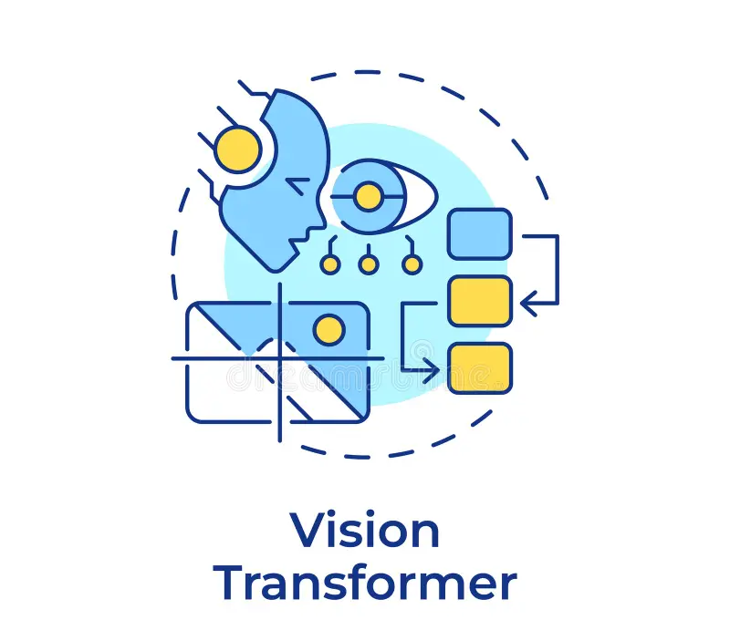

# Vision Transformers

Here, we fine-tuned the ViT-Tiny and ViT-Small models based on the original [code](https://github.com/salvatorecalderaro/Explainable-Histopathology-Classification-ViT) and with our own data. We also visualized the attention maps using the same codebase. The modified code is accessable through [ViT fine-tuning](src/finetune_vit.py) and [attention visualization](src/vis_attention.py). In addition, we modified code to incorporate the [V_Attn](src/finetune_V_Attn_Exact.py) and [E_Attn](src/finetune_E4_Attn.py) variants and retrained both models using the same experimental setup as ViTs. The main training parameters were: 30 epochs, 3-fold cross-validation, 3 classes, 
img_size = (224, 224), lr = 0.002, and mini_batch_size = 32-128.
